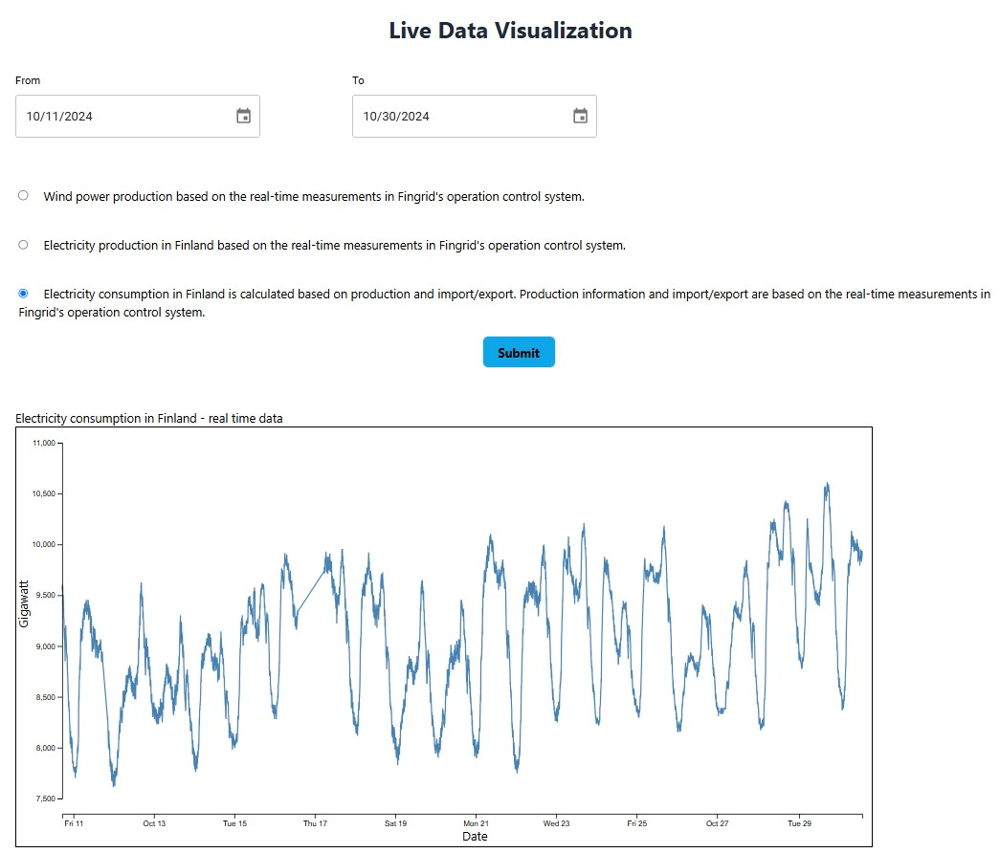

# Live Data Visualization using D3.js



## Description

This project provides a live data visualization of energy information in Finland, specifically focusing on wind power generation, electricity production, and consumption. Users can select a date range and data type to view specific datasets. This visualization is powered by D3.js for dynamic charting and React for UI management.

## Features

- **Date Range Selection**: Choose a time range for data visualization.
- **Data Type Selection**: Select different datasets to display, such as wind power generation, electricity production, and consumption.

## Technologies Used

This project was built with the following tools and libraries:

- **Vite**: Front-end tooling for fast development
- **React**: UI library for building components
- **Redux**: State management library
- **D3.js**: Library for data-driven visualizations
- **Axios**: Promise-based HTTP client for data fetching
- **Material UI**: For UI components
- **Emotion & Styled Components**: For CSS-in-JS styling
- **Tailwind CSS**: Utility-first CSS framework
- **Day.js**: Date handling

## Installation Instructions

- Clone the repository and change the directory

```sh
 git clone https://github.com/MohamadNach/Live-Data-visualization-D3.js.git
 cd Live-Data-visualization-D3.js
```

## Usage Instructions

- Create a developer acount on [Fingrid](https://data.fingrid.fi/en/instructions) website and follow Api instructions.
- You should find Primary key at [Profile](https://developer-data.fingrid.fi/profile) tabe.
- Place API key in your .env file.
- Start the application using the following:

```sh
  npm run dev
```

## API Information

The data is sourced from **Fingrid's Open Data Platform**, which provides a REST API for machine-readable access to datasets. API access requires registration and an API key.

For more information on the API, please visit [Fingrid’s Open Data Platform](https://data.fingrid.fi/).

## Contributing

At this time, external contributions are not required.

## License

You may use this code but should provide attribution to the original author.

## Contact

For questions or feedback, please contact the project owner at [mohamadnach.github.io](https://mohamadNach.github.io).
